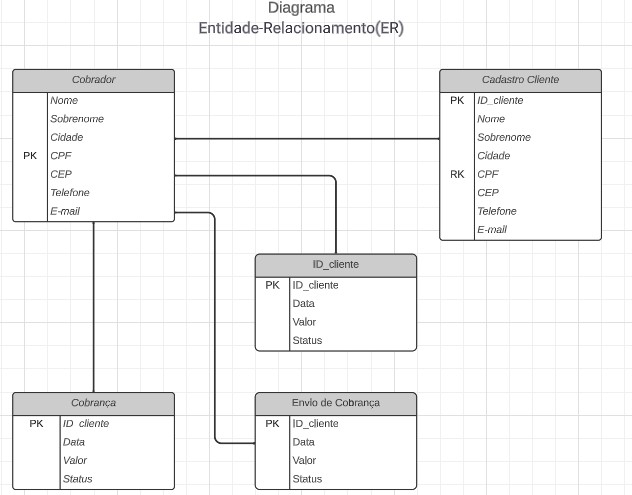

# Arquitetura da Solução

Pré-requisitos: <a href="3-Projeto de Interface.md"> Projeto de Interface</a>

Definição de como o software é estruturado em termos dos componentes que fazem parte da solução e do ambiente de hospedagem da aplicação.

## Diagrama de Classes

O diagrama de classes ilustra graficamente como será a estrutura do software, e como cada uma das classes da sua estrutura estarão interligadas. Essas classes servem de modelo para materializar os objetos que executarão na memória.

## Modelo ER (Projeto Conceitual)

O Modelo ER representa através de um diagrama como as entidades (coisas, objetos) se relacionam entre si na aplicação interativa.
 

## Projeto da Base de Dados

Este projeto de base de dados tem como objetivo criar a estrutura de armazenamento de informações essenciais para a nossa aplicação. A base de dados será projetada para acomodar informações detalhadas sobre clientes e  cobranças e outros atributos relevantes. A estrutura de banco de dados será desenvolvida para garantir eficiência, escalabilidade e integridade dos dados, permitindo que a aplicação gerencie as operações necessárias de forma eficaz e segura.

Tabela **clientes** 
id_cliente (PK) 
Nome 
Sobrenome  
Cidade 
CPF 
CEP 
Telefone  
Email 
 

Tabela **cobrador** 
id_cobrador (PK) 
Nome 
Sobrenome  
Cidade 
CPF 
CEP 
Telefone  
Email 
 

Tabela **Cobrança**  
id_cobranca (PK) 
id_cliente(FK) 
id_cobrador(FK) 
data 
vencimento 
valor 
status 

**Relacionamentos**: 
Um cobrador pode ter vários clientes, e um cliente pode ter vários cobradores. 
  
A Entidade cobrança surge com o relacionamento entre cliente e cobrador. Uma cobrança tem apenas um cobrador e apenas um cliente. 

## Tecnologias Utilizadas

As tecnologias que escolhemos utilizar para implementar a nossa solução são: 
 
- **Linguagens:** C#, JavaScript, HTML/CSS
- **Frameworks e/ou bibliotecas:** ASP.NET e Bootstrap
- **IDEs de desenvolvimento:** Visual Studio Code
- **Ferramentas:** Mysql
  
## Hospedagem

Explique como a hospedagem e o lançamento da plataforma foi feita.

> **Links Úteis**:
>
> - [Website com GitHub Pages](https://pages.github.com/)
> - [Programação colaborativa com Repl.it](https://repl.it/)
> - [Getting Started with Heroku](https://devcenter.heroku.com/start)
> - [Publicando Seu Site No Heroku](http://pythonclub.com.br/publicando-seu-hello-world-no-heroku.html)
